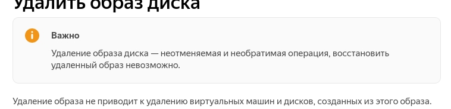
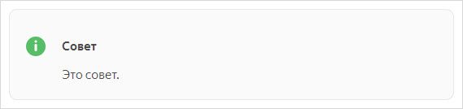
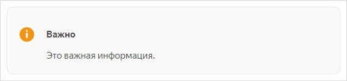
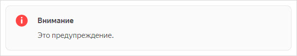
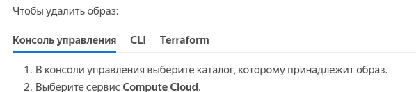

**english** | [русский](https://github.com/yandex-cloud/yfm-transform/blob/master/DOCS.ru.md)
- - -

# Yandex Flavored Markdown (YFM) syntax

## Table of contents

- [Headers](#headers)
- [Styles](#tracings)
- [Lists](#lists)
    - [Unordered list](#unordered_list)
    - [Ordered list](#ordered_list)
- [Tables](#tabels)
- [Links](#links)
- [Code inserts](#code)
    - [Inline code](#inline-code)
    - [Code block](#codeblock)
- [Images](#images)
    - [Direct insert](#direct_insert)
    - [Link insert](#link_insert)
- [Notes](#notes)
    - [Comment](#info)
    - [Tip](#tip)
    - [Warning](#warning)
    - [Alert](#alert)
- [Content reuse](#includes)
- [Tabs](#tabs)
- [Cuts](#cuts)
- [Variables](#vars)
    - [Substitutions](#substitudes)
    - [Conditional operators](#conditions)
    - [Filters](#filters)
    - [Cycles](#cycles)
    - [Functions](#functions)
- [Metadata](#meta)

## Headers <a name="headers"></a>

To create a header, use the (#) character, for example:

```markdown
# H1 header
## H2 header
### H3 header
#### H4 header
```

YFM uses four levels of headers. A page header must be the first level. You can use the second, third, and fourth levels for subsection headers.

**Important!** Make sure you maintain the nesting structure of headers.

## Styles <a name="tracings"></a>

To make text **bold**, wrap it in double asterisks (`*`):

```markdown
This text will be **bold**.
```

To make text _italic_, wrap it in underscores:

```markdown
This text will be _italic_.
```

To make text _**bold and italic**_, use both double asterisks and underscores:

```markdown
This text will be _**bold and italic**_.
This text will be **_bold and italic_**.
```

To format characters in <sup>superscript</sup>, wrap them in ^:

```markdown
This text is in ^superscript^.
```

## Lists <a name="lists"></a>

### Unordered list <a name="unordered_list"></a>

To make an unordered bulleted list, use such characters as `*`, `-`, or `+`.

For example, markdown like:

```markdown
- Element 1
- Element 2
- Element 3
```

will be displayed as:

- Element 1
- Element 2
- Element 3

To make a nested bulleted list, add an indent for items in a child list. The indent can be from two to five spaces. We recommend indenting three spaces.

For example, markdown like:

```markdown
- Element 1
   - Element A
   - Element B
- Element 2
```

will be displayed as:

- Element 1
   - Element A
   - Element B
- Element 2

### Ordered list <a name="ordered_list"></a>

To make an ordered numbered list, use numbers with the `.` or `)` character. The recommended markdown format is `1` and `.`.

For example, markdown like:

```
1. First item
1. Second item
1. Third item
```

will be displayed as:

1. First item
2. Second item
3. Third item

To make a nested ordered list, add an indent for child list items. The indent can be from two to five spaces. We recommend indenting three spaces.

For example, markdown like:

```
1. First item
    1. Nested item
    1. Nested item
1. Second item
```

will be displayed as:

1. First item
   1. Nested item
   1. Nested item
1. Second item

## Tables <a name="tabels"></a>

Tables consist of a single row with headers, a separator row, and rows with data.

Each row in a table consists of cells that are separated from each other by `|` characters.

The cells of the separator row only allow the `-` and `:` characters. The colon (`:`) is used at the beginning, end, or on both sides of the cell content of the separator row to indicate left, right, or center alignment of text in the corresponding column.

A table should be separated from the surrounding text with empty lines.

For example, markdown like:

```markdown
Left column | Right column | Center column
:--- | ---: | :---:
Text | Text | Text
```

will be displayed as:

| Left column | Right column | Center column |
| :--- | ---: | :---: |
| Text | Text | Text |

## Links <a name="links"></a>

Links are presented in the format `[text](link)`, where:

  * `[text]` is the link text.
  * `(link)` is the URL or path to the file referenced.

For example, markdown like:

```markdown
[link to README.md](README.md)
```

will be displayed as:

[link to README.md](README.md)

### Links with automatic text substitution from the header <a name="linkTitle"></a>

YFM lets you add links to other MD files without specifying the link text. It's substituted automatically from the header of the specified file.

For example, a link like:

```markdown
[{#T}](README.md)
```

will be displayed as:

[Yandex Flavored Markdown](README.md)

## Code inserts <a name="code"></a>

You can insert a piece of code in the text of a paragraph or put it in a separate block.

### <a name="inline-code"></a>Inline code

To insert a code fragment into text, use the <code>`</code> character.

For example, markdown like:

```markdown
A sentence with a `code snippet`.
```

will be displayed as:

A sentence with a `code snippet`.

### <a name="codeblock"></a>Code block

To format a code fragment as a separate block, place it in triple <code>`</code>. To highlight the syntax, specify the language that the code is written in.

For example, markdown like:

    ```js
    let a= 10;
    ```

will be displayed as a highlighted code fragment:

```js
let a= 10;
```

## Images <a name="images"></a>

### Direct insert <a name="direct_insert"></a>

To insert an image in a document, use markdown like

```markdown

```

Where:

* `[alt text]` is the alternative text for the image.

* `_assets/image.png` is the path to the image file.

   **Important!** Images should be stored in a directory whose name starts with `_`. Otherwise, they will be deleted when making a build.

* `"Hint text"`: Text of a hint displayed when hovering over the image.

* `=100x200`: Image size in pixels.

### Link insert <a name="link_insert"></a>

You can declare an image in document text once and then invoke it in the text using a short link. To do this:

1. Declare an image:

   ```markdown
   [image]: _assets/image.png "Hint text"
   ```

1. Insert the image using markdown:

   ```markdown
   ![alt text][image]
   ```

This method can be useful when you need to insert the same image multiple times.

## Notes <a name="notes"></a>

A note is a visually highlighted block that lets you draw attention to content.

There are four types of notes: info, tip, warning, and alert.

Don't overuse note blocks, as they may distract the user from the main content.
Although these elements may contain YFM, it's better not to overload them. Make them simple and clear.

### Comment <a name="info"></a>

```markdown


This is info.


```



### Tip <a name="tip"></a>

```markdown


This is a tip.


```



### Warning <a name="warning"></a>

```markdown


This is a warning.


```



### Alert <a name="alert"></a>

```markdown


This is an alert.


```



### Custom header <a name="error"></a>

By default, a note has a standard header, but you can override it:

```markdown


This is a warning.


```

If there is nothing inside the quotes, the note will not have a header:

```markdown


This is a warning.


```

## Reusing content <a name="includes"></a>

You can store duplicate content in a separate file and insert it into a document using the **** element. This is often more convenient than copying and pasting it.

To use the same content in multiple places:

1. Save this text in a separate MD file.

   **Important!** Make sure these files are stored in a directory whose name starts with `_` (for example, `_includes`). Otherwise, the files are deleted when making a build.

1. Insert a link to the file in the document:

   ```markdown
   
   ```

   Where:
   * `notitle`: If the parameter is specified, the file header isn't inserted into the text.
   * `[Description]`: File description. Doesn't affect the build, used only for document refactoring.
   * `(_includes/file.md)`: File path.

As a result, the file content is inserted into the document while making the build. If the file has relative links to other documents or images, they will be rebuilt.

## Tabs <a name="tabs"></a>

You can format text as tabs. This can be useful, for example, to distinguish similar content and not to overload the page with text:



To create a tab, use markdown like:

```markdown


- Name of tab1

  Content of tab1.

  - You can use lists.
  - And **other** markdown.

- Name of tab2

  Content of tab2.


```

**Important!** When using tabs, be sure to leave empty lines:

* Before and after lines `` and ``.
* Between the text of one tab and the title of the next tab.

You can use YFM inside tabs: lists, tables, images, code, and so on.

## Cuts <a name="cuts"></a>

Cuts let you hide content ("cut it"). You can use them in long listings, code examples, and so on. You can use YFM inside a cut.

To make a cut, use markdown like:

```markdown


Content we want to hide


```

## Variables <a name="vars"></a>

In YFM, you can declare and use variables. When making a build, variables are substituted into the text of a document or used to calculate conditions. This is useful, for example, when building the documentation for different versions of a service from the same source files.

### Substitutions <a name="substitudes"></a>

To declare and use variables in a document:

1. In the document root directory, create a file named `presets.yaml`.

1. Declare the variables in `presets.yaml` in the following format:

   ```
   default:
     variable-name-1: value of variable 1
     variable-name-2: value of variable 2
   ```

1. To insert a variable value into a document as text, use markdown like:

   ```
   Some text {{ variable-name-1 }} text continued.
   ```

1. To insert a value into a document as text, use markdown like:

   ```
   Some text not_var{{ variable-name-1 }} text continued.
   ```

### Conditional operators <a name="conditions"></a>

You can include a fragment of text in a document build, depending on variable values.

For example, to build two versions of a document for different operating systems, use markdown like:

```


Download the app from the [App Store](https://www.apple.com/ios/app-store/).



Download the app from [Google Play] (https://play.google.com).


```

Available conditional operators are `if`, `elsif`, and `else`. Available comparison operators are `==`, `!=`, `<`, `>`, `<=`, and `>=`.

### Filters <a name="filters"></a>

**Important!** When using filters, be sure to leave a space before and after the filter operator

Variables in `presets.yaml` for the examples below:

```
default:
  user:
    name: Alice
  users:
    - Alice
    - Mark
```

#### capitalize

```
Hello {{ user.name | capitalize }}! => Hello Alice!
```

#### length
```
{{ users | length }} => 2

{{ user.name | length }} | length => 5
```


### Cycles <a name="cycles"></a>

Variables in `presets.yaml` for the examples below:

```
default:
  users:
    - Alice
    - Mark
```

#### Examples
```
Prefix  {{user}}  Postfix

Prefix Alice Mark Postfix
```

```
Prefix

{{user}}

Postfix

Prefix
Alice
Mark
Postfix
```

```
Prefix   {{user1}}+{{user2}}   Postfix

Prefix Alice+Alice Alice+Mark Mark+Alice Mark+Mark Postfix
```

### Functions <a name="functions"></a>

Variables in `presets.yaml` for the examples below:

```
default:
  user:
    name: Pasha
```

#### slice

```
Hello M{{ user.name.slice(1) }}! => Hello Masha!
```

```
Hello M{{ user.name.slice(1, 2) }}sha! => Hello Masha!
```

## Metadata <a name="meta"></a>

You can add YAML metadata at the beginning of a file.

```
---
title: Title
description: Description
---
```
